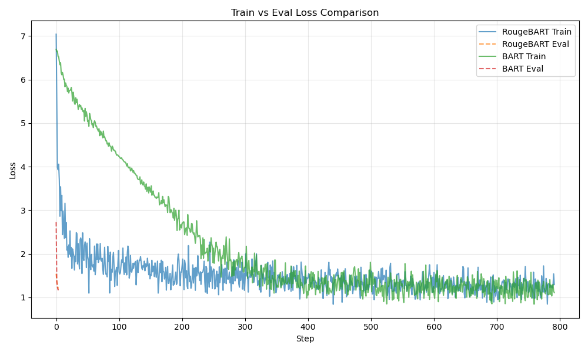
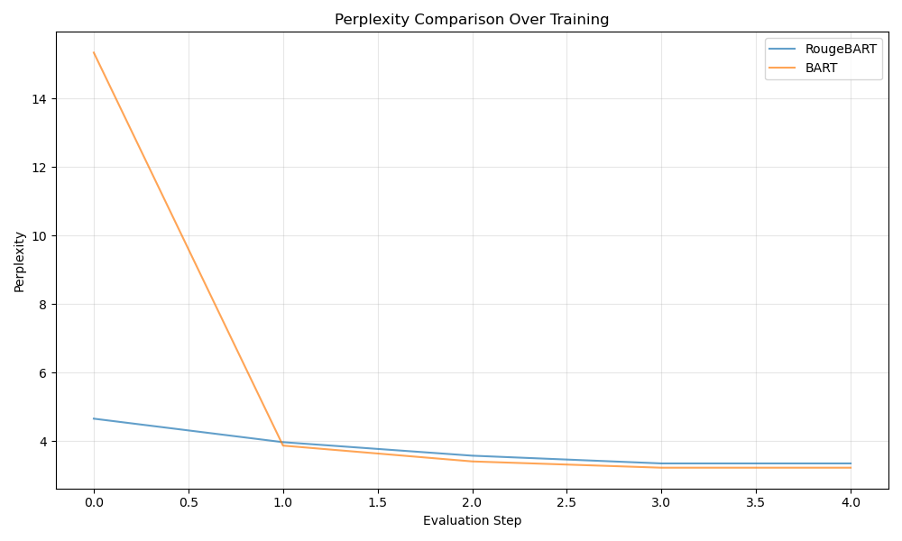

# RougeBART

A clean, minimal encoder-decoder sequence-to-sequence model built on components from **Rougeformer**. Designed for research and experimentation, RougeBART implements a BART-like architecture without auxiliary objectives (e.g., no masked token prediction or MTP).

---

## Key Features

- **Encoder**: Uses `TransformerEncoderLayer` from Rougeformer, featuring:
  - Grouped-query attention (GQA)
  - Rotary positional embeddings (RoPE)
  - Optional sliding window attention with global token support
  - RMSNorm and GELU-based feed-forward networks

- **Decoder**: Custom `TransformerDecoderLayer` with:
  - Causal self-attention (RoPE + GQA)
  - Standard cross-attention over encoder outputs
  - RMSNorm and consistent dropout placement

- **Shared Embeddings**: Input and output embeddings are weight-tied.

- **KV Caching**: Supports incremental decoding with past key-value caching for efficient text generation.

- **Generation Utilities**: Includes a basic `generate()` method with temperature, top-k, and top-p sampling.

- **Robust Mask Handling**: Converts padding masks to finite additive attention masks (using `-1e4` instead of `-inf`) to avoid NaNs during training.




```
======================================================================
📊 Parameter Comparison:
RougeBART: 15,656,960
BART       : 17,599,360
Difference: 1,942,400 (12.41%)
GFLOPs per layer (B=1, L=128)
----------------------------------------
RougeBART     enc: 0.168  dec: 0.231
BART          enc: 0.168  dec: 0.231
----------------------------------------
encoder Δ = 0.00%   decoder Δ = 0.00%
RougeBART: [27:50]
[RougeBART] Epoch 1 | Train Loss: 1.4905 | Eval Loss: 1.2106 | PPL: 3.36

BART: [18:51]
[BART] Epoch 1 | Train Loss: 2.1677 | Eval Loss: 1.1726 | PPL: 3.23
======================================================================
FINAL RESULTS (10% data, 1 epoch)
======================================================================
RougeBART:
  - Final Eval Loss: 1.2106
  - Final Perplexity: 3.36
  - Total Train Steps: 792
  - Parameters: 15,656,960

BART:
  - Final Eval Loss: 1.1726
  - Final Perplexity: 3.23
  - Total Train Steps: 792
  - Parameters: 17,599,360

📊 Difference:
  - Loss Difference: 0.0380
  - PPL Difference: 0.12
======================================================================
```
---

## Dependencies

- Python 
- PyTorch
- pytest
- `Rougeformer.py` must be in the Python path (defines `TransformerEncoderLayer`, `GQA_RoPE_Attention`, and `RMSNorm`)

---

## Usage

### 1. Model Instantiation

```python
from RougeBART import RougeBART

model = RougeBART(
    vocab_size=32000,
    max_seq=512,
    num_layers=6,
    hidden_size=320,
    intermediate_size=1280,
    num_heads=8,
    kv_groups=2,
    rotary_max_seq=2048,
    window=64,
    dropout=0.1,
    pad_token_id=0,
    decoder_start_token_id=2
)
```

### 2. Training Forward Pass

```python
outputs = model(
    input_ids=src_ids,          # [B, S]
    attention_mask=src_mask,    # [B, S], 1 = unmasked
    labels=tgt_ids              # [B, T], -100 for ignored tokens
)

loss = outputs["loss"]
logits = outputs["logits"]
```

### 3. Text Generation

```python
generated = model.generate(
    input_ids=src_ids,
    attention_mask=src_mask,
    max_new_tokens=100,
    temperature=0.9,
    top_k=50,
    do_sample=True
)
# Returns [B, T_generated]
```
### 4. Unit Test

`pytest -v test_models.py`

---

## Architecture Notes

- The encoder uses **sliding window attention** (window size configurable) with optional **global positions** for long-range dependencies.
- The decoder uses **causal self-attention** (no sliding window) and **standard multi-head cross-attention** over encoder states.
- All normalization uses **RMSNorm**; no LayerNorm or bias terms in attention projections.
- Dropout is applied in the FFN intermediate layer and after attention outputs.
- Positional information is injected via **RoPE**, not learned embeddings.

```
Rougeformer = stacked encoder blocks + tied head  
RougeBART   = same encoder + almost-same decoder (add cross-attn, causal self-attn, kv-cache)

Legend
======
|  op  |  shape (batch, seq, dim)  |  comment
-------------------------------------------------
  Emb   (B, L, D)     token embedding  (weight-tied to lm_head)
  +     residual add
  RMS   RMSNorm
  GQA   GQA-RoPE multi-head attention (sliding-window + optional globals)
  FFN   SwiGLU style: Linear▶GELU▶Linear
  Mask  additive mask: 0 = keep, −1e4 = drop
  CA    cross-attention (decoder only)
  ◀━    kv-cache hook (decode only)
```

Rougeformer (encoder-only, causal-LM)
```
input_ids
   │
   ▼
  Emb ──Dropout─┐
   │            │
   ▼            │
  RMS            │
   │            │
   GQA ──Mask───┼──(sliding window + global positions)
   │            │
   ▼            │
   FFN          │
   │            │
   ▼            │
   + ◀━━━━━━━━━━┘   (residual around whole block)
   │
   ▼
  RMS (final)
   │
   ▼
 lm_head  (weight = Emb.weight)
   │
   ▼
logits / loss
Repeat the “RMS ▶ GQA ▶ FFN ▶ +” block N times (default 8).
```

RougeBART (encoder-decoder)
Encoder (identical to Rougeformer layers, but bidirectional):
```
input_ids ──Emb──Dropout──►┌──────────┐
                           │  RMS     │
                           │  GQA ──Mask (no causal, window OK)
                           │  FFN     │
                           └─▲──┬──▲─┘
                             │  │  │      repeat N layers
                             └──+──┘
                                │
                             RMS (norm)
                                │
                         encoder_hidden_states
```
Decoder (causal, cross-attends to encoder):
```
decoder_input_ids ──Emb──Dropout──►┌──────────────┐
                                   │  RMS         │
                                   │  GQA ─Causal─Mask ◀━ kv-cache
                                   │  +           │
                                   │  RMS         │
                                   │  CA ───────────────┐
                                   │  +           │     │ encoder_hidden_states
                                   │  RMS         │     │
                                   │  FFN         │     │
                                   └─▲──┬──▲─────┘     │
                                     │  │  │            │  repeat N layers
                                     └──+──┘            │
                                        │               │
                                     RMS (norm)         │
                                        │               │
                                    lm_head (tied)      │
                                        │               │
                                     logits / loss ◀━━━━┘
```
---

## Limitations

- Not compatible with Hugging Face `transformers` out of the box (no `AutoModel` support).
- No built-in tokenizer; assumes pre-tokenized inputs.
- Designed for fixed-context training; dynamic sequence lengths supported but not optimized for extreme variance.
- Generation is basic—lacks beam search, length penalties, or repetition control.

---

## License

This code is provided for research purposes. MIT.

---

> **Note**: RougeBART depends on `Rougeformer.py`. Ensure it is accessible in your `PYTHONPATH` or colocated in the same directory.
